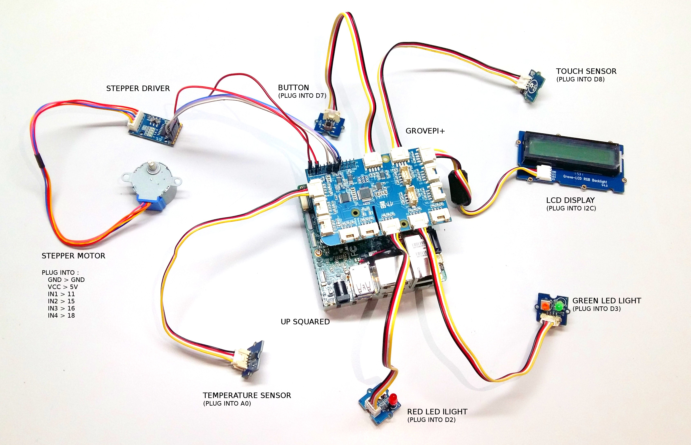
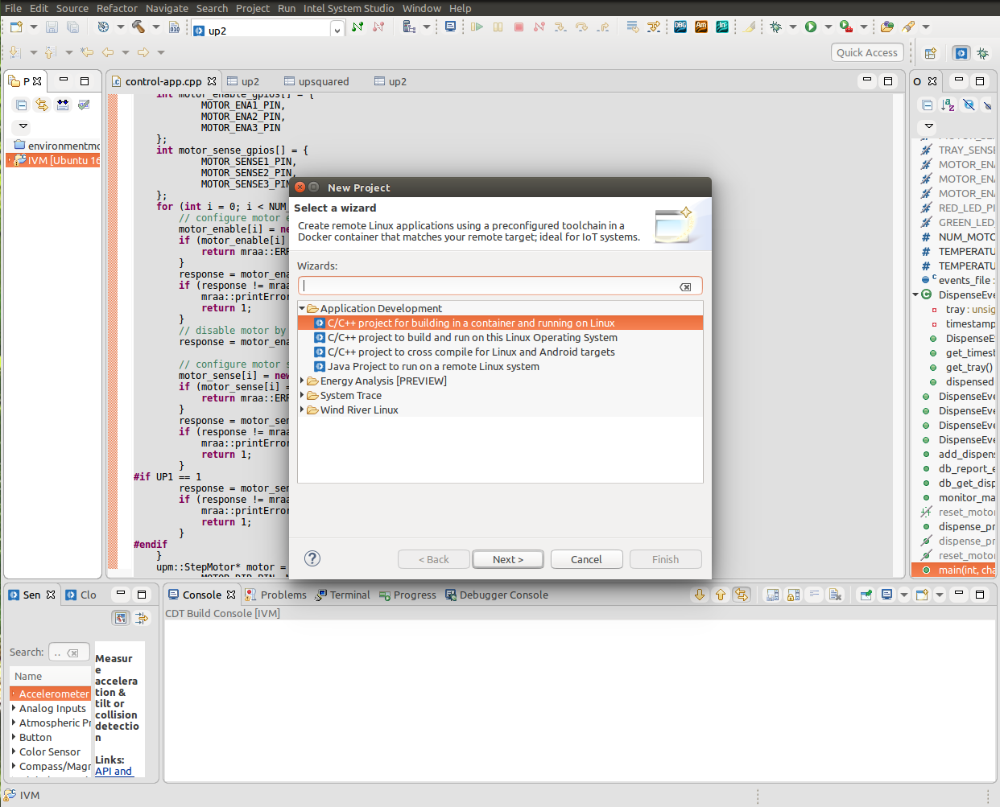
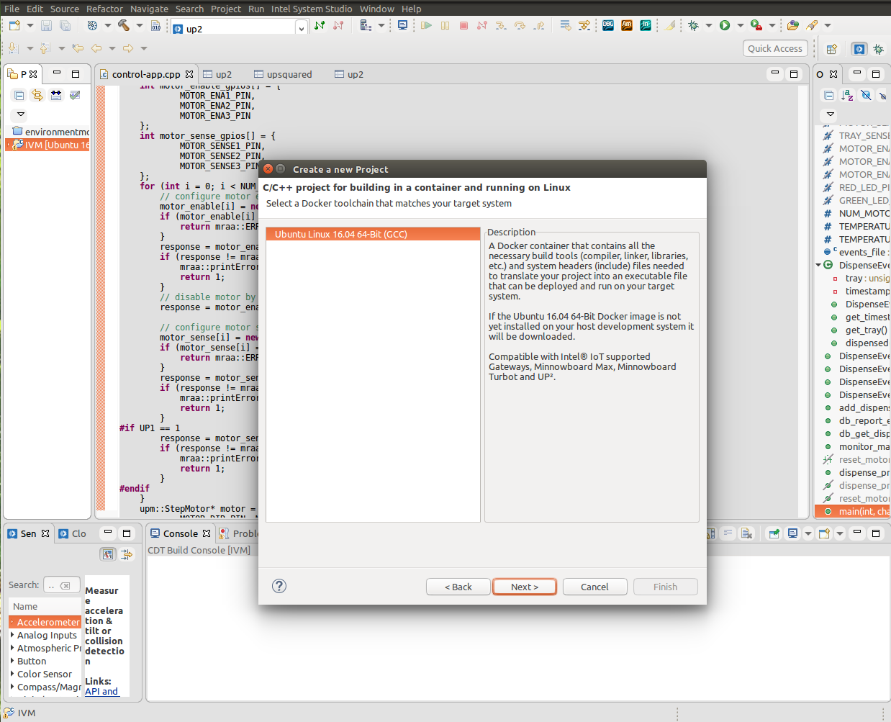
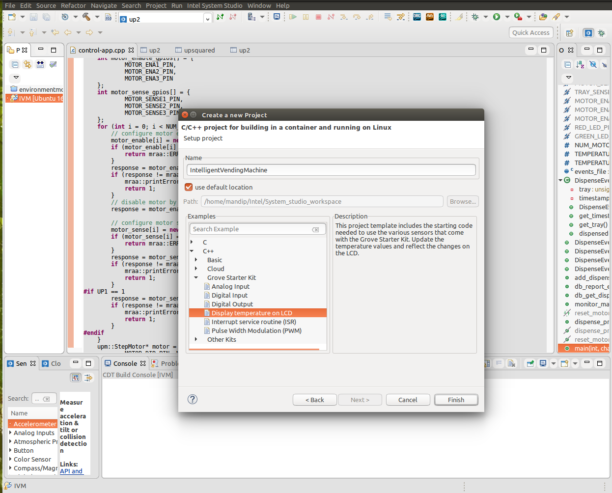
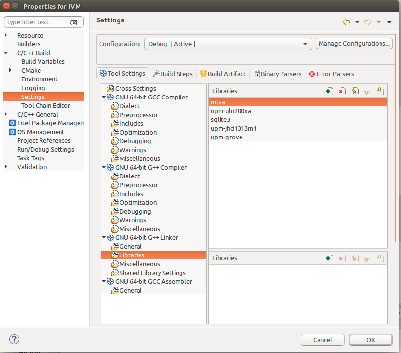

# Path to Product - Intelligent Vending Machine

This guide demonstrates a rapid path-to-product IoT solution for retail using cloud data analytics. This proof of concept was created using the UP Squared* Grove* IoT Development Kit that was scaled to an industrial solution using an UP²* board, industrial sensors, Intel® System Studio, and Microsoft Azure* cloud services. This solution monitors the inventory, product sales, and maintenance of a vending machine.

## Setup The System Hardware

This section describes how to set up all the required hardware for the Intelligent Vending Machine: UP Squared\* and Grove Sensors

Setting up the UP² board for this solution consists of the following steps:

 1. Connect a monitor via the HDMI\* or VGA port and a USB keyboard. These are required for [OS deployment](https://www.ubuntu.com/download/iot/up-squared-iot-grove-server) and can be removed after the UP² board has been connected to the network and a connection from the development environment has been established.
 2. Plug in an Ethernet cable from your network’s router.
 3. Plug in the power supply for the UP² board but DO NOT press the power button yet. First connect the GrovePi and other hardware components and then power on the UP² board.

### Sensor Setup

 1. Connect GrovePi+ board to the UP² board. 
 2. Connect sensors to the GrovePi+ board in the following manner:
  * Jhd1313m1 LCD display -> I2C pin
  * Button                -> D7 Pin
  * Touch Sensor          -> D8 Pin
  * Green Led Light       -> D3 Pin
  * Red Led Light         -> D2 Pin
  * Temperature sensor    -> A0 Pin
  * Stepper Driver        -> IN1 -> 11
  * IN2 -> 15
  * IN3 -> 16
  * IN4 -> 18
  * GND -> GND
  * VCC -> 5V
  * Stepper Motor         -> Stepper Driver

	
	*Figure 1. Sensors and pin connections.*


## Install and Configure the Required Software

This section gives instructions for: installation of the operating system, connecting the UP² board to the Internet, installing required software libraries, and finally cloning the project sources from a GitHub\* repository.
	
### Installing the OS: Ubuntu\* Server
	
The UP Squared board comes with a preinstalled version of the Ubuntu* 16.04 operating system. Follow the instruction mentioned [here](https://www.ubuntu.com/download/iot/up-squared-iot-grove-server) to install Ubuntu on a UP² board, if not already installed.

### Connecting the UP² to the Internet

This section describes how to connect the UP² board to your network, which will enable you to deploy and run the project from a different host on the same network (i.e. your laptop). Internet access is required in order to download the additional software libraries and the project code.

The following sections describe the commands that need to be entered into a terminal (shell) on the UP² board:

#### Ethernet

 1. Once Ubuntu is installed, restart the UP² board and login using your user.
 2. Type in the command `ifconfig` and find the interface named `enp3s0` in the list. In some cases, this might show up as `eth0` instead. Use the name displayed here for the following step.
 3. Open the network interface file using the command: `vim /etc/network/interfaces` and the following lines to it:
 
    ```
    auto enp3s0
    iface enp3s0 inet dhcp
    ```

 4. Save and exit the file and restart the network service using the following command: `/etc/init.d/networking restart`.
 5. If you are connecting to external networks via a proxy, you will have to set it up as well.


#### Installing the MRAA, UPM and sqlite3 libraries on the UP²\* Board

 In order to put UPM and MRAA on your system, you can just use MRAA:PPA to update the libraries. The instructions are as follows:

```
sudo add-apt-repository ppa:mraa/mraa
sudo apt-get update
sudo apt-get install libupm-dev libupm-java python-upm python3-upm node-upm upm-examples
sudo apt-get install sqlite3 libsqlite3-dev
```

**Note:** Now we can disconnect monitor and keyboard from UP² board, as we can remote acces UP² board using its IP address, which needs our Laptop/Desktop to be on the same network as UP² board.

## Create the Development and Runtime Environment on Desktop/Laptop

#### Linux\* Installation
 1. Download Intel® System Studio from [https://software.intel.com/en-us/system-studio](https://software.intel.com/en-us/system-studio) and extract.
 2. Open a new Terminal window and navigate to the directory you extracted the contents of the installer file to.
 3. Run `install.sh` script and follow the instructions provided there to install Intel® System Studio.

### Add the Solution to Intel® System Studio

This section gives the steps to add the solution to Intel® System Studio, including creating a new project and populating it with the files needed to build and run it.

 1. Open Intel® System Studio. It will start by asking for a workspace directory; choose one and then click **OK**.
 2. From the Intel® System Studio , select File > New > Project, 
   Then choose `Create a C/C++ project for building in a container and running on Linux` under Application Development in New Project. 

 	
  
 	*Figure 2. New project*

	
  
 	*Figure 3. New project*


 3. Give the project a name, such as `IntelligentVendingMachine`, and in the examples choose the `Display Temperature on LCD` under C++ > Grove Starter Kit and then click **Next**.

	
  
 	*Figure 4. Adding Project Name.*


 4. 
   * Copy over the `control-app.cpp` from control-application directory into the new project's src folder in Intel® System Studio 
   * Next right click on the project name and follow the sequence: Properties > C/C++ Build > Settings > GNU 64-bit G++ Linker > Libraries and then Add libraies: mraa, upm-uln200xa, sqlite3, upm-jhd1313m1, upm-grove. This can be done by clicking on the small green '+' icon on the top right side of the libraries view

	
  
 	*Figure 5. Adding libraries to the build path*


 5. In order to run this project, connect to the UP² board first using the IP address already provided. Follow the instructions provided in [https://software.intel.com/en-us/developing-projects-with-intel-system-studio-c-creating-an-ssh-connection](https://software.intel.com/en-us/developing-projects-with-intel-system-studio-c-creating-an-ssh-connection) to connect to the UP² board as root (root privileges are required to use pins on board).

 6. Before running the project we need to copy and run a Node.js\* script which communicates with the Cloud. 
   * azure-storage and sqlite3 node packages are required:  Install using: `npm install azure-storage sqlite3`.

   Copy the Cloud folder on the UP² board using scp command from your desktop/laptop: 
   `scp -r /home/ubuntu/intelligent-vending-machine/Cloud   upsquared@###.###.###.###:/home/upsquared/`
   
   Then remote login to the UP² board using ssh (`ssh upsquared@##.###.###.###` ) and run shell script comm_azure.sh: 
   `sh comm_azure.sh ivm.db`

   (If behind proxy, edit proxy details in `comm_azure.sh`)

 7. In Intel® System Studio run the project : Run > Run.

### Intelligent Vending Machine Web Application

Requirements: Node.js, npm, MongoDB\*, compass (Sass-based Stylesheet Framework - http://compass-style.org/install/)

1. Open a terminal (shell) on laptop.

2. Go to admin-customer-application folder. Run script using: `sh build.sh`
	
  **Note:**   If behind proxy modify build.sh accordingly.

3. Run server: `./server/bin/www`

4. In the browser goto `http://localhost:9000` to open the webapp. 
   Enter MAC address of UP² in the textbox provided and click **Start**, it will open admin app.
   To open customer mobile app Navigate to `http://localhost:9000/#/mobile` 
   


